# Keyes入门学习套件 高级版

1.简介：

你想学习编程知识吗?
只要你对科学充满热情，敢于探索新事物，这个Keyes入门学习套件高级版工具包一定是你的最佳选择。这个工具包是一款基于Arduino的Scratch图形化编程、Mixly图形化编程和C语言编程等三种编程方式的学习工具包。用一个控制器（Plus控制板），许多传感器/模块和电子元件，你可以做许多精彩的DIY项目。该工具包附带35个项目教程，每个教程都有详细的接线图、元件知识和迷人的项目代码等，完全适合初学者。你可以学习电子、物理、科学和编程很多知识。

2.清单：
当收到这个Keyes入门学习套件高级版工具包的时候，首先看到是一个包装精美的外盒，每个配件被安全且有序的装在外盒里面的小袋子里，先来清点一下：(KE3018含Plus开发板，KE3017不含Plus开发板)

||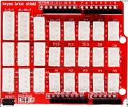||||||
|-|-|-|-|-|-|-|
|Plus 开发板*1|传感器扩展板*1|蓝色LED*10|红色LED*10|黄色LED*10|绿色LED*10|RGB*1|
|||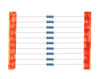|||||
|220Ω 电阻*10|10KΩ 电阻*10|1KΩ 电阻*10|4.7KΩ 电阻*10|10KΩ电位器*1|有源蜂鸣器*1|无源蜂鸣器*1|
|||||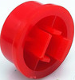|||
|按键开关*4|倾斜开关*1|光敏电阻*2|火焰传感器*1|红帽*2|黄帽*2|IC 74HC595N *1|
|||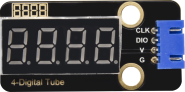|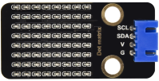|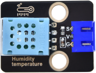||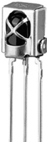|
|ESP8266串口WIFI ESP-01*1|一位数码管*1|四位数码管模块*1|8*8点阵屏*1|温湿度传感器*1|1602 I2C LCD *1|红外接收器*1|
|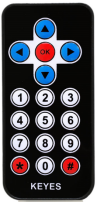|||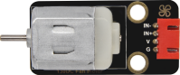|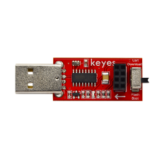|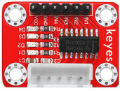||
|红外遥控器*1|舵机*1|130电机风扇叶*1|130 直流电机模块*1|USB转ESP-01S WIFI模块串口测试扩展板*1|步进电机驱动板*1|步进电机*1|
|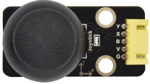|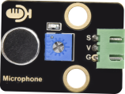|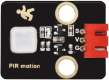|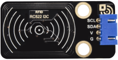|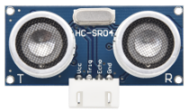|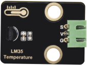|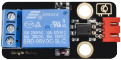|
|摇杆模块*1|声音传感器*1|人体红外传感器*1|RFID刷卡模块*1|超声波传感器*1|LM35温度传感器*1|5V继电器模块*1|
|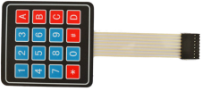||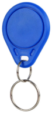||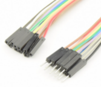|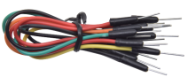|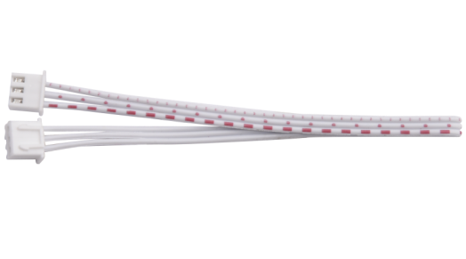|
|4*4薄膜键盘*1|10K热敏电阻*1|ABS蓝色钥匙扣*1|白卡*1|公对母杜邦线*10|面包板跳线*30|3P 双头连接线*3|
|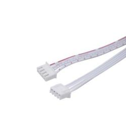|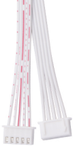|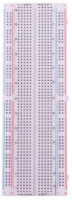||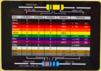|||
|4P 双头连接线*3|5P 双头连接线*3|830孔面包板*1|USB线*1|电阻卡*1|公对公杜邦线*10||

