Keyes入门学习套件 高级版
========================

1.简介：

你想学习编程知识吗?
只要你对科学充满热情，敢于探索新事物，这个Keyes入门学习套件高级版工具包一定是你的最佳选择。这个工具包是一款基于Arduino的Scratch图形化编程、Mixly图形化编程和C语言编程等三种编程方式的学习工具包。用一个控制器（Plus控制板），许多传感器/模块和电子元件，你可以做许多精彩的DIY项目。该工具包附带35个项目教程，每个教程都有详细的接线图、元件知识和迷人的项目代码等，完全适合初学者。你可以学习电子、物理、科学和编程很多知识。

2.清单：
当收到这个Keyes入门学习套件高级版工具包的时候，首先看到是一个包装精美的外盒，每个配件被安全且有序的装在外盒里面的小袋子里，先来清点一下：(KE3018含Plus开发板，KE3017不含Plus开发板)

+-------------------+----------------+------------------+-----------------+--------------------------+------------------+----------------+
| |image1|          | |image2|       | |image3|         | |image4|        | |image5|                 | |image6|         | |image7|       |
+===================+================+==================+=================+==========================+==================+================+
| Plus 开发板*1     | 传感器扩展板*1 | 蓝色LED*10       | 红色LED*10      | 黄色LED*10               | 绿色LED*10       | RGB*1          |
+-------------------+----------------+------------------+-----------------+--------------------------+------------------+----------------+
| |image8|          | |image9|       | |image10|        | |image11|       | |image12|                | |image13|        | |image14|      |
+-------------------+----------------+------------------+-----------------+--------------------------+------------------+----------------+
| 220Ω 电阻*10      | 10KΩ 电阻*10   | 1KΩ 电阻*10      | 4.7KΩ 电阻*10   | 10KΩ电位器*1             | 有源蜂鸣器*1     | 无源蜂鸣器*1   |
+-------------------+----------------+------------------+-----------------+--------------------------+------------------+----------------+
| |image15|         | |image16|      | |image17|        | |image18|       | |image19|                | |image20|        | |image21|      |
+-------------------+----------------+------------------+-----------------+--------------------------+------------------+----------------+
| 按键开关*4        | 倾斜开关*1     | 光敏电阻*2       | 火焰传感器*1    | 红帽*2                   | 黄帽*2           | IC 74HC595N    |
|                   |                |                  |                 |                          |                  | \*1            |
+-------------------+----------------+------------------+-----------------+--------------------------+------------------+----------------+
| |image22|         | |image23|      | |image24|        | |image25|       | |image26|                | |image27|        | |image28|      |
+-------------------+----------------+------------------+-----------------+--------------------------+------------------+----------------+
| ESP8266串口WIFI   | 一位数码管*1   | 四位数码管模块*1 | 8\ *8点阵屏*\ 1 | 温湿度传感器*1           | 1602 I2C LCD \*1 | 红外接收器*1   |
| ESP-01*1          |                |                  |                 |                          |                  |                |
+-------------------+----------------+------------------+-----------------+--------------------------+------------------+----------------+
| |image29|         | |image30|      | |image31|        | |image32|       | |image33|                | |image34|        | |image35|      |
+-------------------+----------------+------------------+-----------------+--------------------------+------------------+----------------+
| 红外遥控器*1      | 舵机*1         | 130电机风扇叶*1  | 130             | USB转ESP-01S             | 步进电机驱动板*1 | 步进电机*1     |
|                   |                |                  | 直流电机模块*1  | WIFI模块串口测试扩展板*1 |                  |                |
+-------------------+----------------+------------------+-----------------+--------------------------+------------------+----------------+
| |image36|         | |image37|      | |image38|        | |image39|       | |image40|                | |image41|        | |image42|      |
+-------------------+----------------+------------------+-----------------+--------------------------+------------------+----------------+
| 摇杆模块*1        | 声音传感器*1   | 人体红外传感器*1 | RFID刷卡模块*1  | 超声波传感器*1           | LM35温度传感器*1 | 5V继电器模块*1 |
+-------------------+----------------+------------------+-----------------+--------------------------+------------------+----------------+
| |image43|         | |image44|      | |image45|        | |image46|       | |image47|                | |image48|        | |image49|      |
+-------------------+----------------+------------------+-----------------+--------------------------+------------------+----------------+
| 4\ *4薄膜键盘*\ 1 | 10K热敏电阻*1  | ABS蓝色钥匙扣*1  | 白卡*1          | 公对母杜邦线*10          | 面包板跳线*30    | 3P             |
|                   |                |                  |                 |                          |                  | 双头连接线*3   |
+-------------------+----------------+------------------+-----------------+--------------------------+------------------+----------------+
| |image50|         | |image51|      | |image52|        | |image53|       | |image54|                | |image55|        |                |
+-------------------+----------------+------------------+-----------------+--------------------------+------------------+----------------+
| 4P 双头连接线*3   | 5P             | 830孔面包板*1    | USB线*1         | 电阻卡*1                 | 公对公杜邦线*10  |                |
|                   | 双头连接线*3   |                  |                 |                          |                  |                |
+-------------------+----------------+------------------+-----------------+--------------------------+------------------+----------------+

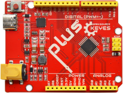
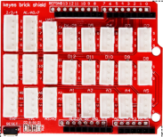
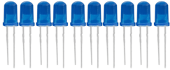
.. |image4| image:: media/cddded49c863ef913bbe2ef3832da74b.png
.. |image5| image:: media/679ad0aaef0b7b199aaf0967e1aa5367.png
.. |image6| image:: media/0eead4be7850896afc83477bd7c260d8.png

.. |image8| image:: media/7ea6c448cde965cc0c899e3906b16398.png
.. |image9| image:: media/1baebd241a5c0654eb9bc571db904683.png
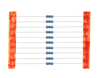
.. |image11| image:: media/fcff9bef757327b78b545fd9193b9397.png
.. |image12| image:: media/d0a42506a43071b51bc17f9e39caa37c.png
.. |image13| image:: media/60a660b4c23562a74563483b7af3f568.png
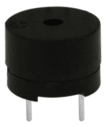
.. |image15| image:: media/5b8fea4657b47510d199f740fdcaaa9d.png
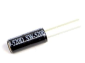
.. |image17| image:: media/7ea5721963dbb796fde0e7c2f3e8e4b5.png
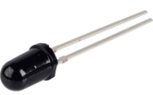
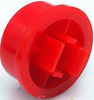
.. |image20| image:: media/8defa4d3994ce0f2291b05c2fd04ee9c.png
.. |image21| image:: media/e5756d5b6983fb93087e49a42482dcb8.png
.. |image22| image:: media/408f9f823aab6078768f08462eda209b.png
.. |image23| image:: media/c88b647385c69cfc1a6746a3c459ab12.png
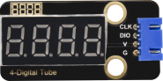
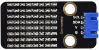
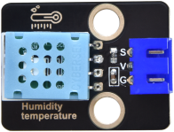
.. |image27| image:: media/a63cc057fe7d72e8c84bf08d8aad6465.jpeg
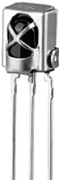
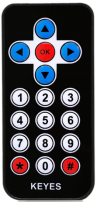
.. |image30| image:: media/1886ee7e1faeea2c093ae626e1b8baaf.png
.. |image31| image:: media/009965e315276ecf1144c22c54a93fd9.png
.. |image32| image:: media/d513c5f772c5520560bb48f8ccdd1e6a.png
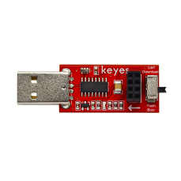
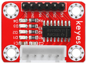
.. |image35| image:: media/277ad05e0d79dc19d169b5ddc164346e.jpeg
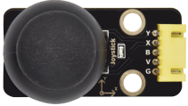
.. |image37| image:: media/dea3617ca9c0d05ecbcd279c34566f10.png
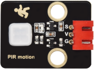
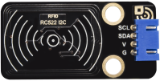
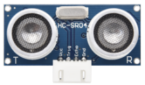
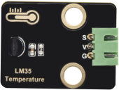
.. |image42| image:: media/bde9eec7397ac2247681093363c9117e.png
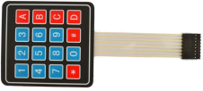
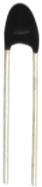
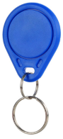

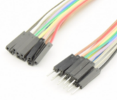
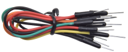
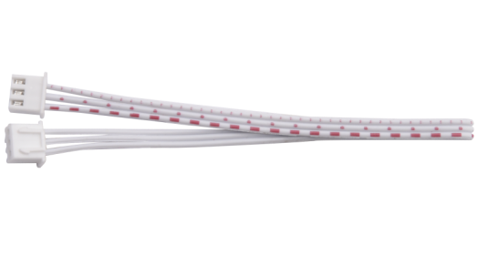
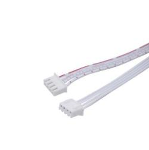
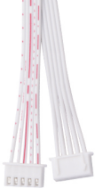
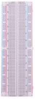
.. |image53| image:: media/298482b666685306a7a06c2c5d924fce.png
.. |image54| image:: media/89aaafefa692d400a031a0e213879c56.png
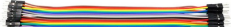
