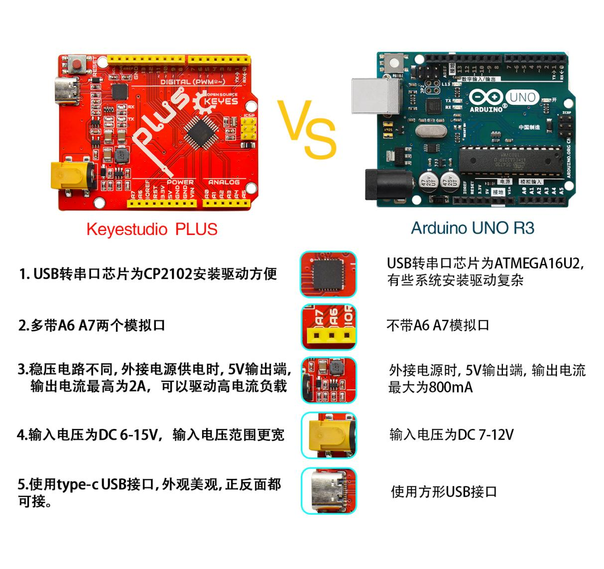
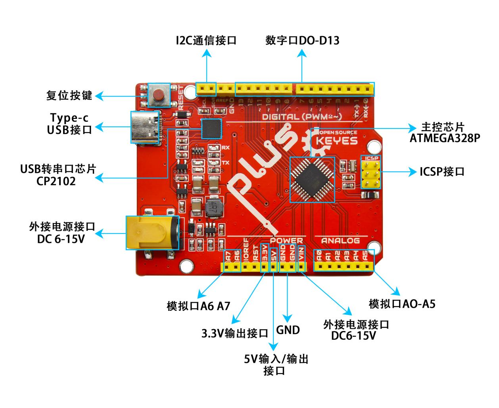

# Keyestudio Uno PLUS控制板

在我们开始Keyes 2021入门学习套件高级版工具包之前，我们首先介绍Keyestudio Uno PLUS控制板，它是所有项目的核心。Keyestudio Uno PLUS控制板完全兼容Arduino IDE开发环境的控制板，包含Arduino UNO R3的所有功能，并且在 UNO R3板的基础上，我们做了一些改进，使它的功能更加强大。它是学习如何构建电路和设计自己的代码的最好的选择。让我们得到更详细的相关信息。

规格参数：

微控制器：ATMEGA328P-AU

USB转串口芯片：CP2102

工作电压：DC 5V

外接电源: DC 6-15V（建议9V）

数字I/O引脚: 14 (D0-D13)

PWM通道：6 (D3 D5 D6 D9 D10 D11)

模拟输入通道（ADC）: 8(A0-A7)

每个I/O直流输出能力: 20 mA

3.3V端口输出能力: 50 mA

Flash Memory: 32 KB（其中引导程序使用0.5 KB）

SRAM:2 KB (ATMEGA328P-AU)

EEPROM: 1 KB (ATMEGA328P-AU)

时钟速度:16MHz

板载LED引脚:D13

各个接口和主要元件说明：

特殊功能接口说明：

串口通信接口：D0为RX、D1为TX

PWM接口（脉宽调制）：D3 D5 D6 D9 D10 D11

外部中断接口：D2(中断0)和D3 (中断1)

SPI通信接口：D10为SS、D11为MOSI、D12为MISO、D13为SCK

IIC通信端口：A4为SDA、A5为SCL

