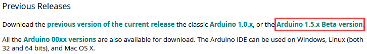
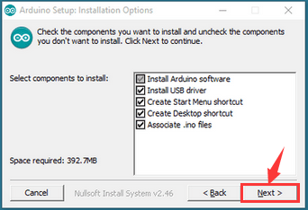
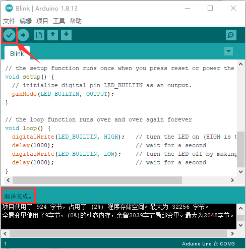
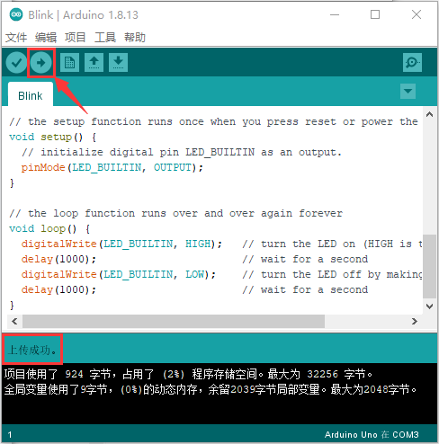

# Arduino软件

1.安装Windows驱动程序

## 1.1 下载安装arduino软件：

先进入arduino官方的网站：[<u>https://www.arduino.cc/</u>](https://www.arduino.cc/)
，下载最新版本的arduino软件。进入网站之后会看到以下这个界面，如下图所示：

需要下载的arduino软件就在SOFTWARE这个栏目里面

点击DOWNLOADS，就会出现最新版本的ARDUINO软件，Arduino
软件有很多版本，有Windows、Mac、Linux系统的，如下图所示：

选择要下载的版本，可以下载最新的版本。

或者，你也可以选择旧版本，如下图所示。但在这个项目中，我们选择使用的是1.8.13版本。

点击Windows Win7and newer下载Arduino 1.8.13版本的安装程序，需要手动安装。而当你点击Windows ZIP file时，Arduino 1.8.13版本的zip文件将被直接下载，您只需要解压缩它就可以完成安装。

一般情况下，点击JUST DOWNLOAD就可以下载了，当然如果你愿意，你可以选择小小的赞助，以帮助伟大的Arduino开源事业。

下载完成后，继续安装，当你收到操作系统的警告时，请允许驱动程序安装。选择好要安装的组件后点击“下一步”。

选择安装目录(我们建议保持默认目录)，然后点击“安装”。

如果出现以下界面，则应选择Install.

该过程将提取并安装所有必需的文件，以正确执行Arduino软件(IDE)。

## 1.2 在Windows系统上安装驱动：（注意：如果电脑已经安装了驱动程序，则不需要再安装驱动；如果没有，则需要进行以下操作）

在使用Keyes Uno Plus控制板之前，必须安装它的驱动程序，否则它将无法与计算机通信。与Arduino UNO R3的USB系列芯片(ATMEGA8U2)不同，Keyes Uno Plus控制板采用了USB系列芯片CP2102芯片和USB C型接口。在Arduino IDE 1.8.0版本及以上版本中包含了CP2102芯片的驱动程序。通常，您将控制板通过USB线连接到计算机，电脑就会识别到硬件，WINDOWS系统就会自动安装CP2102的驱动。过一会儿，CP2102
驱动就会安装成功。

注意:

1.  请确保您的IDE更新到1.8.0或更新版本；

2.  如果您下载的Arduino     IDE版本低于1.8，请下载CP2102的驱动程序并手动安装。

    下载CP2102驱动程序的链接：[https://fs.keyestudio.com/CP2102-WIN](https://fs.keyestudio.com/CP2102-WIN)

如果驱动安装失败，则需要手动安装驱动。请打开计算机的设备管理器，右键单击“计算机”-----单击“属性”-----单击“设备管理器”。在端口
(COM &LPT)或其他设备。黄色感叹号表示CP2102驱动程序安装失败。

显示CP2102的驱动没有安装成功，有一个黄色的感叹号。我们可以双击硬件更新驱动

点击“浏览我的电脑以查找驱动程序(R)”，找到我们安装或者下载的Arduino软件.

在Arduino软件文件夹（）里面有一个drivers文件夹，打开drivers文件夹就可以看到CP210X系列芯片的驱动。

点击“浏览(R)...”,选中CP210X系列芯片的驱动，点击“下一步”。

过一会儿，驱动安装成功。

这个时候再打开计算机设备管理器，你就可以看到CP2102的驱动程序已经安装成功了，刚刚的那个黄色的感叹号不见了。

## 1.3 配置Arduino IDE

驱动程序安装成功后，是时候配置IDE使用相同的设备和端口开始上传代码。对于keyes Uno PLUS控制板，我们应该转到工具→开发板；然后选择Arduino Uno(如下图所示)。

然后选择正确的COM端口。驱动安装成功后，可以看到对应的COM口。

转到工具→端口→COM3

将代码程序上传到控制板之前，必须演示Arduino IDE工具栏中出现的每个符号的功能。

A - 用于检查是否存在任何编译错误。

B - 用于将程序上传到Arduino控制板（keyes Uno PLUS控制板）。

C - 用于创建新草图的快捷方式。

D - 用于直接打开示例草图之一。

E - 用于保存草图。

F - 用于从板接收串行数据并将串行数据发送到板的串行监视器。

## 1.4 开始第一个程序

打开“文件”选择“示例”，从“Basics”中选择“Blink”，如下图所示：

当草图窗口打开时，您可以在窗口中看到整个草图。

设置板型和COM口，对应的板型和COM口显示在IDE的右下角。

点击开始编译程序，检查错误。

点击上传程序，几秒种后，上传成功。

上传程序成功，利用USB线上电，keyes Uno PLUS控制板上的板载LED灯点亮1秒，熄灭1秒，循环进行。恭喜你，完成了第一个项目。

2.在MAC 系统上安装驱动

## 2.1下载安装arduino软件：

## 2.2下载CP2102的驱动程序： 

相关下载链接：[<u>https://fs.keyestudio.com/CP2102-MAC</u>](https://fs.keyestudio.com/CP2102-MAC)

## 2.3如何安装CP2102驱动程序：（注意：如果已经安装了驱动程序，则不需要再安装驱动；如果没有，则需要进行以下操作）

（1）用USB线将keyes Uno PLUS控制板连接到你的MacOS系统电脑上，并打开Arduino IDE。

点击工具，选择主板:“Arduino Uno”，串口为
/dev/cu.usbserial-0001。

点击上传代码，如果上传成功，如下图所示，会显示上传成功。

注意：如果上传代码程序成功了，则不需要再安装驱动，可以跳过下面安装驱动的步骤；如果没有上传成功，则需要跟着下面的步骤安装CP2102驱动。执行下面（2）~（13）步。

（2）CP2102驱动下载链接：

<https://www.silabs.com/products/development-tools/software/usb-to-uart-bridge-vcp-drivers>

（3）点击下载MacOS 版本。

（4）解压下载好的压缩包。

（5）打开文件夹，双击SiLabsUSBDriverDisk.dmg文件。

可以看到以下文件。

（6）双击 Install CP210x VCP Driver 等待界面。

（7）点击Continue

（8）先点击Agree ，然后点击Continue

（9）继续点击Continue ，然后输入你的用户密码

（10）回到安装界面，根据提示等待安装

（11）安装成功

（12）打开arduinoIDE，点击工具，选择主板为Arduino Uno
，串口为/dev/cu.usbserial-0001

（13）然后再点击上传程序，就可以看到烧录成功。

3. 将库文件安装到Arduino

什么是库?

库是一组代码，可以方便地连接到传感器、显示器、模块等。例如，内置的LiquidCrystal库可以帮助与LCD显示器对话。Internet上还有数百个额外的库可供下载。参考资料(https://www.arduino.cc/en/Reference/Libraries)中列出了内置库和其中一些附加库。

如何安装库？

## 3.1 手动安装 

（以下是以Windows系统为例，MacOS系统可以参考）

当你想手动添加一个库时，首先要退出Arduino应用程序，然后需要将库作为ZIP文件下载，将其展开并放入适当的目录中。

以下载安装IR Remote库为例，我们进入链接：[<u>https://github.com/shirriff/Arduino-IRremote</u>](https://github.com/shirriff/Arduino-IRremote)，在GitHub上找到IR Remote库。首先，通过点击绿色Code按钮，然后点击download ZIP，这样就可以下载IR Remote的ZIP库

下载后，解压IRremote库文件包。

然后将IRremote库文件包移到Arduino文件夹。

打开Arduino文件夹中的libraries文件夹，然后将Arduino- irremote
-master文件夹拖动到Libraries文件夹中。

这样，库文件手动安装完成了。

个人建议：（使用我们提供的库文件，省得去下载）

使用我们提供的库文件，将每一个库文件压缩包依次解压后分别复制粘贴到软件Arduino文件夹中的libraries文件夹中去。

例如：以为例，右键点击，选择点击“解压文件（A）...”

将解压后的文件包复制粘贴到软件Arduino文件夹中的libraries文件夹中去。

依次类推，采用上述方法将剩下的库文件解压后都分别复制粘贴到软件Arduino文件夹中的libraries文件夹中去。

这样，库文件就手动添加完成了。

