# Scratch 课程

## KidsBlock软件

（以下是以Windows系统为例，MacOS系统可以参考）

1.软件中各按钮的功能：

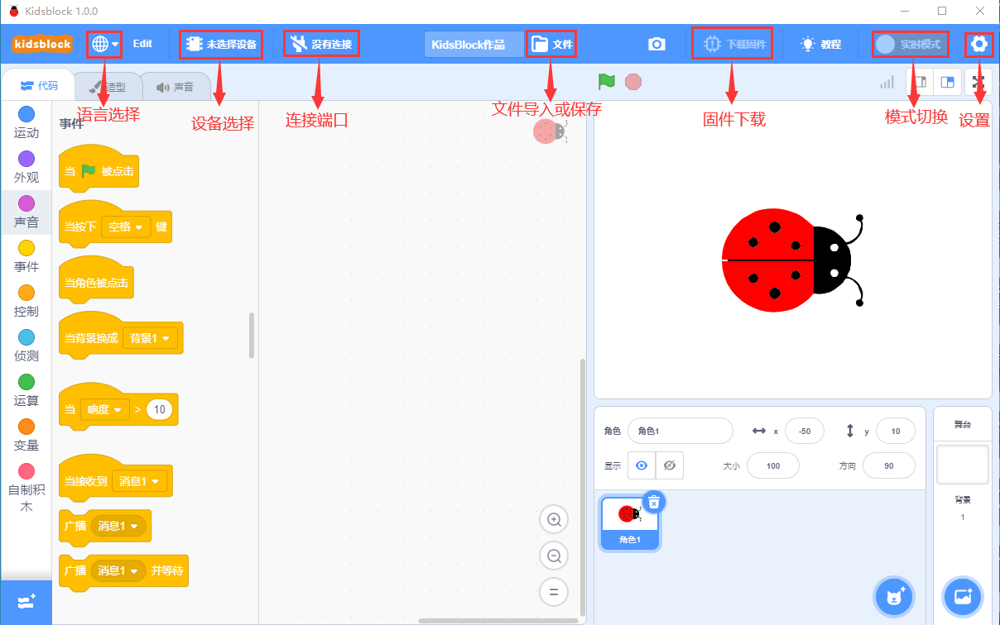

2.  点击可以选择语言“English”和“简体中文”。

    

3.  点击，选择点击“安装驱动”。（注意：如果电脑已经安装了驱动程序，则不需要再安装驱动；如果没有，则需要进行以下操作）

    A.在“设备驱动程序安装向导”页面选择点击“下一页”。

    

2.  过一会儿，选择点击“完成”。

    

3.  选择点击“下一页”。

    

4.  选择点击“完成”。

    

5.  如果出现安全页面，选择点击“允许”即可，然后选择点击“Install”。

    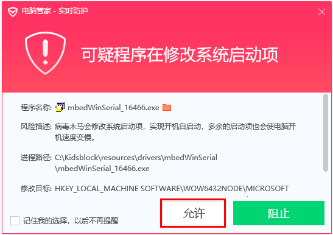

    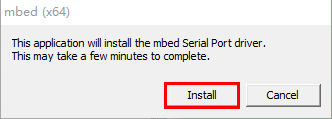

    E.选择点击“安装”。

    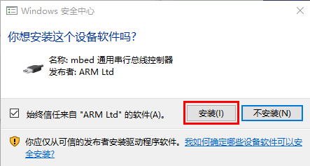

6.  过一会儿，点击“Finish”。

    

7.  选择点击“Extract”。

    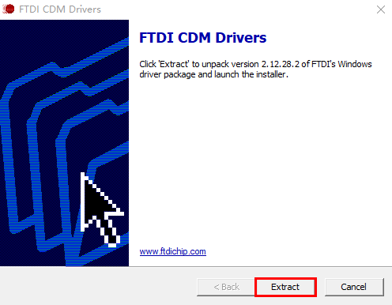

8.  选择点击“下一页”。

    

9.  选择点击“我接受这个协议”后，点击“下一页”。

    

10. 选择点击“完成”。

    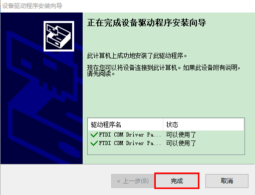

11. 选择“安装”。

    

15. 过几秒钟后，驱动安装完成，点击“确定”即可。

    

4.  驱动安装完后，点击进入主控板页面，可以选择需要添加的设备（控制板），本项目需要选择Uno     Plus主控板。先点击Uno Plus主控板所处区域，后点击“连接”。这样Uno     Plus主控板已连接上，点击“返回编辑器”回到编码编辑器。这样，我们会发现变成，同时变成，说明Uno     Plus主控板和端口（COM） 都已经连接上了。

    

    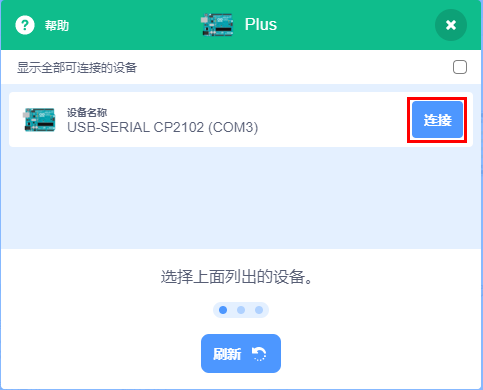

    

    

5.  假如Uno     Plus主控板已经连接上后，但是没有变成，则需要手动点击来连接端口（COM）。先点击，在出现的对话页面中点击，连接成功后，会出现“已连接”页面，说明端口已连接上了。

    

    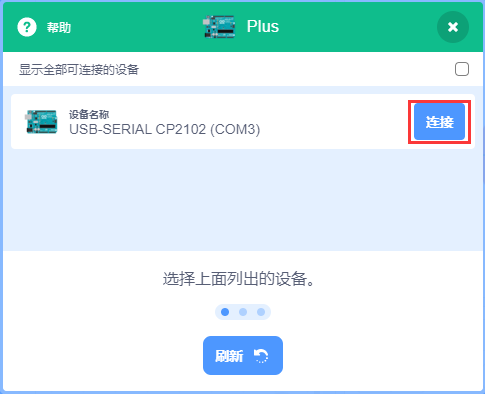

    

    

    如果需要断开端口，先点击，在出现的对话页面中点击“断开连接”。这样，端口就断开了。

    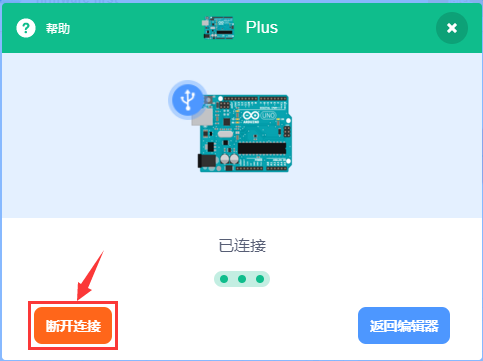

6.  Uno     Plus主控板和端口（COM）都已经连接上，接着点击切换模式，这样就可以将切换成。

    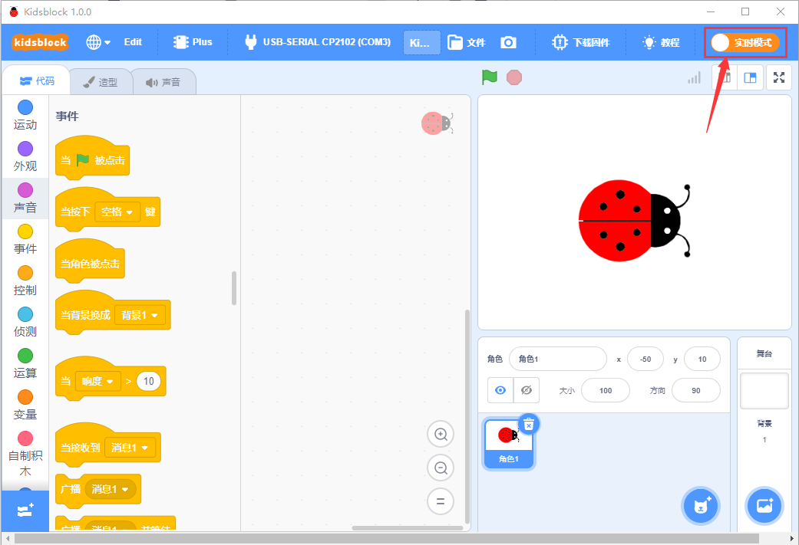

    

    

7.  是添加传感器/模块和元件的扩展包，点击可以进入传感器/模块扩展库界面，点击传感器/模块所处区域，就可以添加对应的传感器/模块。例如需要添加无源蜂鸣器模块，点击“无源蜂鸣器”所处区域，“未加载”变成“已加载”，说明“无源蜂鸣器”模块添加成功。

    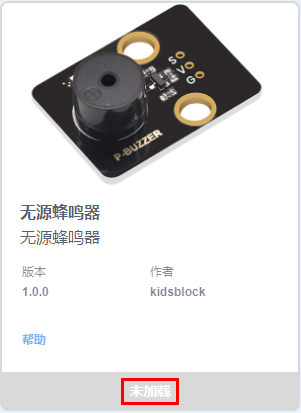
    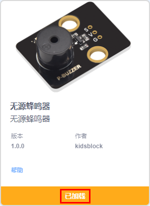

    点击，可以回到代码编辑器界面，在模块区可以看到添加的“无源蜂鸣器”模块。

    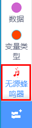
    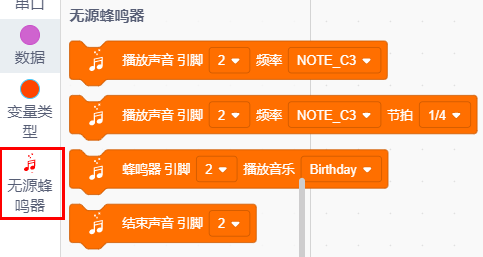

    如果需要删除“无源蜂鸣器”模块，只需要点击再次进入传感器/模块扩展库界面，点击“无源蜂鸣器”所处区域，“已加载”变成“未加载”，则说明“无源蜂鸣器”模块删除成功。
    

    其他的传感器/模块和元器件的添加和删除，方法是一样的。

8.  打开已有的SB3类型文件的方法：

方法1：鼠标左键双击SB3类型文件，这样就可以打开SB3类型文件。例如：需要打开文件，则只需要左键双击文件就可以直接打开。

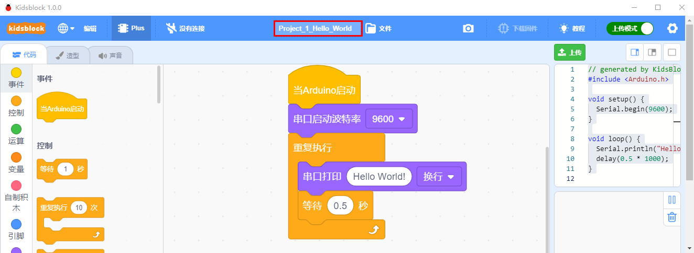

方法2：打开Kidsblock软件，点击“文件”，选择点击“从电脑中上传”，在电脑上选中需要打开的SB3类型文件（例如：文件）

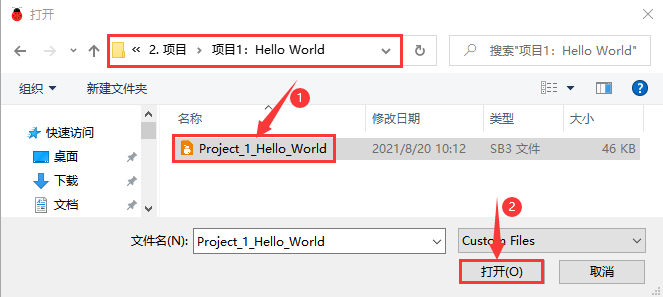

