Scratch 课程
============

KidsBlock软件
-------------

（以下是以Windows系统为例，MacOS系统可以参考）

1.软件中各按钮的功能：

|image1|

2.  点击\ |image2|\ 可以选择语言“English”和“简体中文”。

    |image3|

3.  点击\ |image4|\ ，选择点击“安装驱动”。（注意：如果电脑已经安装了驱动程序，则不需要再安装驱动；如果没有，则需要进行以下操作）

    A.在“设备驱动程序安装向导”页面选择点击“下一页”。

    |image5|

4.  过一会儿，选择点击“完成”。

    |image6|

5.  选择点击“下一页”。

    |image7|

6.  选择点击“完成”。

    |image8|

7.  如果出现安全页面，选择点击“允许”即可，然后选择点击“Install”。

    |image9|

    |image10|

    E.选择点击“安装”。

    |image11|

8.  过一会儿，点击“Finish”。

    |image12|

9.  选择点击“Extract”。

    |image13|

10. 选择点击“下一页”。

    |image14|

11. 选择点击“我接受这个协议”后，点击“下一页”。

    |image15|

12. 选择点击“完成”。

    |image16|

13. 选择“安装”。

    |image17|

14. 过几秒钟后，驱动安装完成，点击“确定”即可。

    |image18|

15. 驱动安装完后，点击\ |image19|\ 进入主控板页面，可以选择需要添加的设备（控制板），本项目需要选择Uno
    Plus主控板。先点击Uno Plus主控板所处区域，后点击“连接”。这样Uno
    Plus主控板已连接上，点击“返回编辑器”回到编码编辑器。这样，我们会发现\ |image20|\ 变成\ |image21|\ ，同时\ |image22|\ 变成\ |image23|\ ，说明Uno
    Plus主控板和端口（COM） 都已经连接上了。

    |image24|

    |image25|

    |image26|

    |image27|

16. 假如Uno
    Plus主控板已经连接上后，但是\ |image28|\ 没有变成\ |image29|\ ，则需要手动点击\ |image30|\ 来连接端口（COM）。先点击\ |image31|\ ，在出现的对话页面中点击\ |image32|\ ，连接成功后，会出现“已连接”页面，说明端口已连接上了。

    |image33|

    |image34|

    |image35|

    |image36|

    如果需要断开端口，先点击\ |image37|\ ，在出现的对话页面中点击“断开连接”。这样，端口就断开了。

    |image38|

17. Uno
    Plus主控板和端口（COM）都已经连接上，接着点击\ |image39|\ 切换模式，这样就可以将\ |image40|\ 切换成\ |image41|\ 。

    |image42|

    |image43|

    |image44|

18. |image45|\ 是添加传感器/模块和元件的扩展包，点击\ |image46|\ 可以进入传感器/模块扩展库界面，点击传感器/模块所处区域，就可以添加对应的传感器/模块。例如需要添加无源蜂鸣器模块，点击“无源蜂鸣器”所处区域，“未加载”变成“已加载”，说明“无源蜂鸣器”模块添加成功。

    |image47| |image48|

    点击\ |image49|\ ，可以回到代码编辑器界面，在模块区可以看到添加的“无源蜂鸣器”模块。

    |image50| |image51|

    如果需要删除“无源蜂鸣器”模块，只需要点击\ |image52|\ 再次进入传感器/模块扩展库界面，点击“无源蜂鸣器”所处区域，“已加载”变成“未加载”，则说明“无源蜂鸣器”模块删除成功。\ |image53|
    |image54|

    其他的传感器/模块和元器件的添加和删除，方法是一样的。

19. 打开已有的SB3类型文件的方法：

方法1：鼠标左键双击SB3类型文件，这样就可以打开SB3类型文件。例如：需要打开\ |image55|\ 文件，则只需要左键双击\ |image56|\ 文件就可以直接打开。

|image57|

方法2：打开Kidsblock软件，点击“文件”，选择点击“从电脑中上传”，在电脑上选中需要打开的SB3类型文件（例如：\ |image58|\ 文件）

|image59|

|image60| |image61|

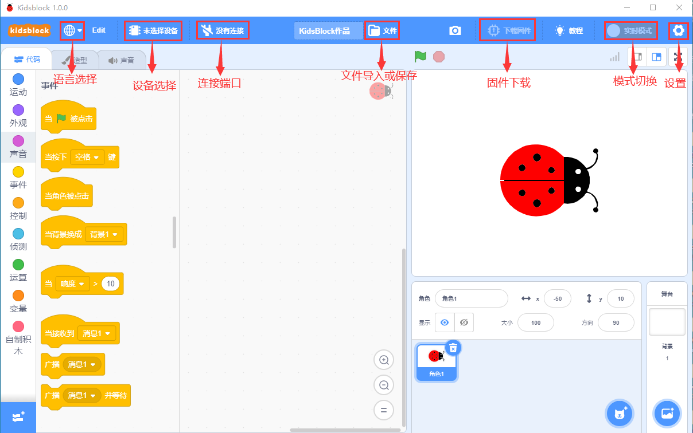
.. |image2| image:: media/3dd044ace633a5f7218b0d19a55ff9cf.png
.. |image3| image:: media/a26ac98fda5eb460bae6370e017e1869.png
.. |image4| image:: media/ceea175e15c8425a1a70baaaf56d40b3.png

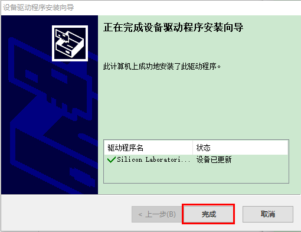

.. |image8| image:: media/1d1562c2614b811ff0cb43da449985a1.png
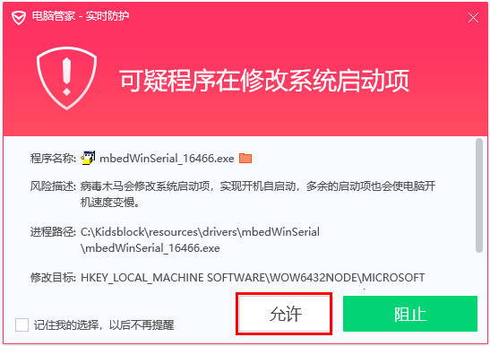
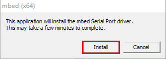
.. |image11| image:: media/7f1a8c8dbe51711f213c382aeb0228c2.png
.. |image12| image:: media/06a890be5adedc1400ecd722634099e8.png
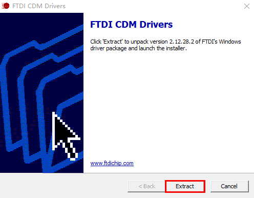
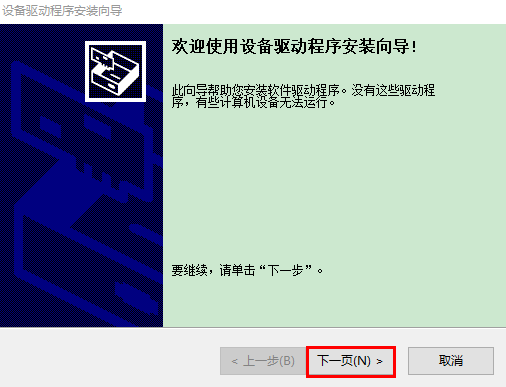
.. |image15| image:: media/c176eaa9b8a278d497b5cb3aed623331.png
.. |image16| image:: media/86e3fce6103bbd8e80f058d26b5fc77f.png
.. |image17| image:: media/5a7ee544df41f82915ad7a07c5367988.png
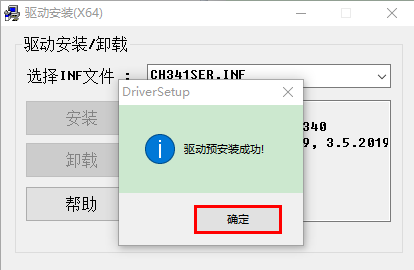
.. |image19| image:: media/33193aae5cf46bccd050b84af65b9dde.png
.. |image20| image:: media/e3d5380fcd0890ff6320185808d7fab9.png

.. |image22| image:: media/8cac6f60c26e2b10d1b2dc313ea5eb03.png
.. |image23| image:: media/4f8778ff131729b181ea6ec292614a3c.png
.. |image24| image:: media/dffb264fb8b7313928d1ae0f8d23b4d9.png
.. |image25| image:: media/2fce58968e59ac36c46a9a1f84193ef7.png
.. |image26| image:: media/3ff6136ef4a84bea34669b28e98ed032.png
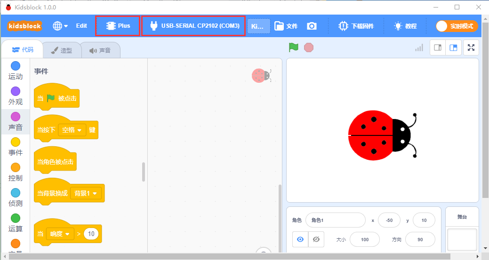
.. |image28| image:: media/8cac6f60c26e2b10d1b2dc313ea5eb03.png
.. |image29| image:: media/4f8778ff131729b181ea6ec292614a3c.png
.. |image30| image:: media/8cac6f60c26e2b10d1b2dc313ea5eb03.png
.. |image31| image:: media/8cac6f60c26e2b10d1b2dc313ea5eb03.png
.. |image32| image:: media/a034167a19e4c273d77848c3df421dc3.png
.. |image33| image:: media/0565cad4c8bc481413810ddfe2cc6563.png
.. |image34| image:: media/22cd29b6a1a6970409239eb7e610dbb3.png
.. |image35| image:: media/e38ca3317bc7fa51081b680cc03f361f.png

.. |image37| image:: media/4f8778ff131729b181ea6ec292614a3c.png
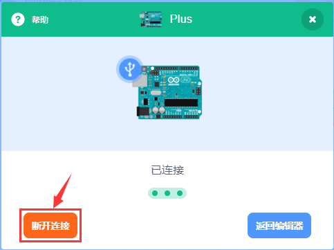
.. |image39| image:: media/44a15c56037a5e48ecbb79a3ea02cd4c.png
.. |image40| image:: media/44a15c56037a5e48ecbb79a3ea02cd4c.png
.. |image41| image:: media/aa20eb800371bb25be725dd0ce5179c1.png
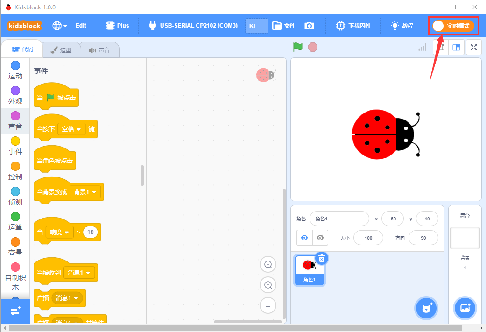
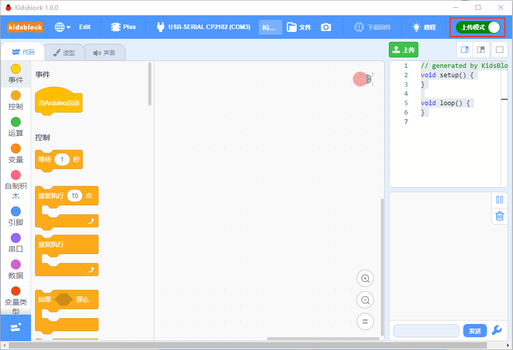
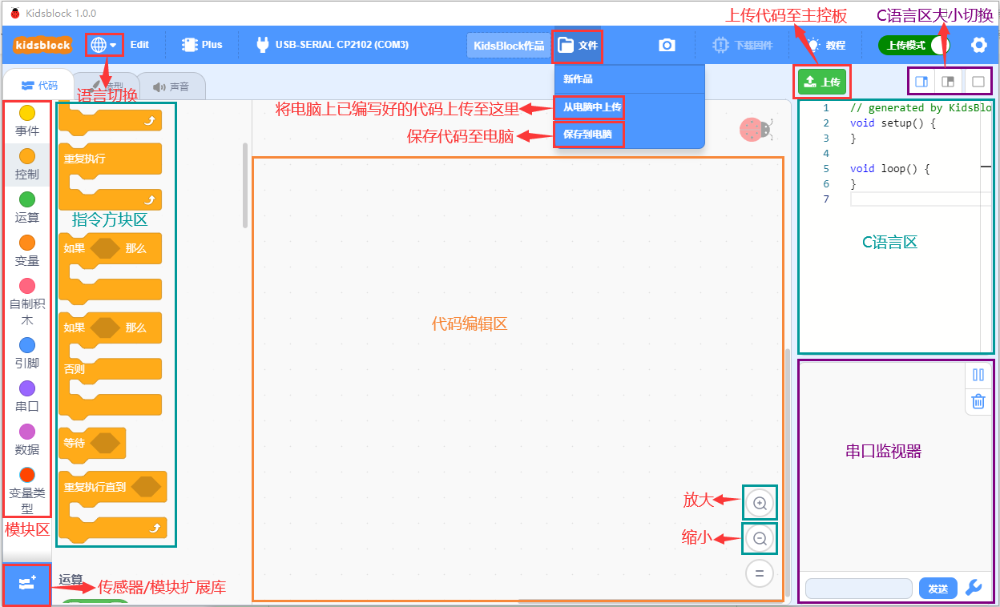
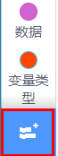

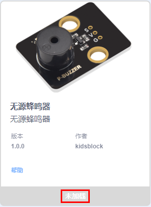
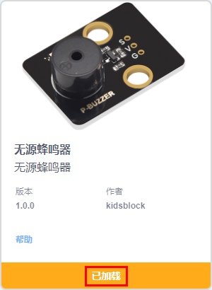
.. |image49| image:: media/95039e92d5182ecb0bccc177aaec3f80.png

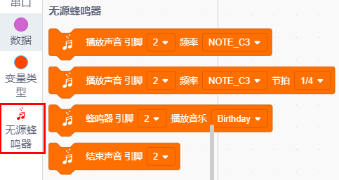

.. |image55| image:: media/2f17c9c0a70a25b0d8e3899e205e94cc.png
.. |image56| image:: media/2f17c9c0a70a25b0d8e3899e205e94cc.png
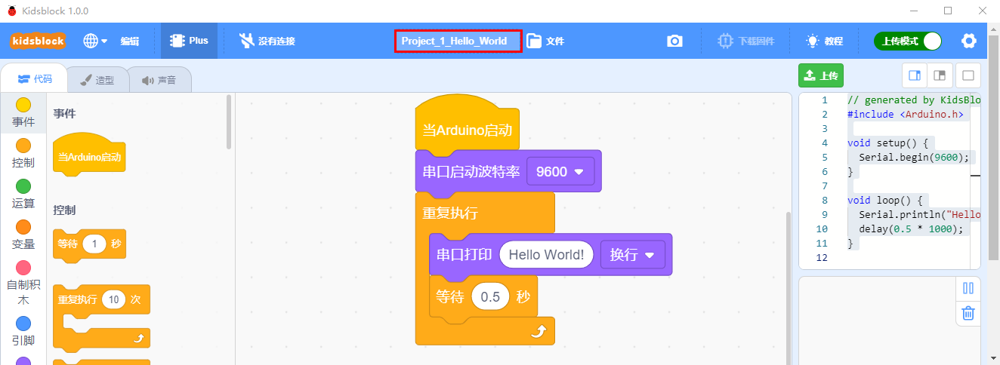
.. |image58| image:: media/2f17c9c0a70a25b0d8e3899e205e94cc.png
.. |image59| image:: media/c8b69ae6e64fda3bae42967c3ad84d84.png
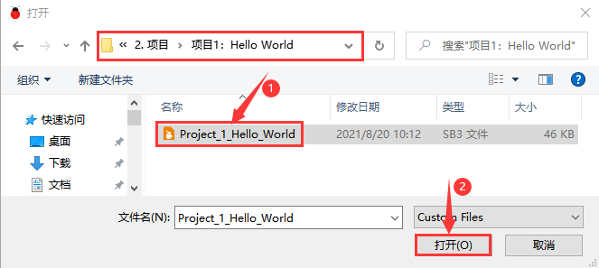

